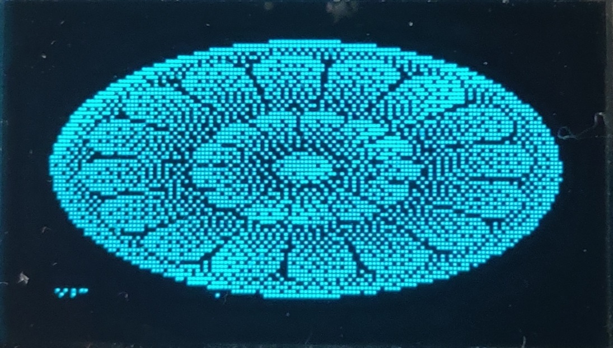

# Demo
## Image Mode
 - GUI
 

    
 - OLED 128\*64
 

    
 - TFT 320\*240
 

    
## Video Mode & Screen Mode

 Please watch the [demo video](https://www.bilibili.com/video/BV1v7411A7sF/ "OLED GUI Demo | 上位机工具"). 
 
# Hardware:
- STM32F103CET6 Blue Pill
- OLED_12864_SSD1306 with IIC interface, or you could port to other screen interfaces.
- USB to UART converter
- ST-Link Debuger, any tools could the download program to the MCU.

# 硬件：
- STM32F103CET6 Blue Pill
- OLED_12864_SSD1306 IIC 接口，或者你能移植到其它屏幕或接口
- USB-UART 转换接口
- ST-Link 调试器，任何能够下载程序到MCU的均可

# IDE:
- MCU: CubeMX_IDE, or you can port my source code to your IDE.
- Python IDE: PyCharm, not required if you know how to run python in a terminal.

# 集成开发环境：
- 单片机：CubeMX_IDE，或者你可以移植源代码到你使用的IDE
- Python：PyCharm，并不是必须的，可以在命令行中运行程序

# Python Modules:
- python 3.x

> I wrote an environment setup script in \python_gui\tools\environment_setup.py,
		which could help you install modules below,
		but you must first install python 3.x to run this script.
		
> 我写了一个环境建立的脚本在：\python_gui\tools\environment_setup.py,
		它可以帮助你安装下面的模块，
		但是首先你得安装Python 3.x来运行这个脚本

- pyserial
- numpy
- opencv-python
- PyQt5
- pywin32

# How to Run:
    0, Make sure you have all the required hardware and software.
    1, Download the MCU program and connect USB2UART module, then restart MCU.
	2, Run GUI on a Windows PC:
		0, Open the folder: \python_gui
		1, Open a terminal enter and run cmd: python main.py
			Or Run main.py in PyCharm IDE.
		2, Scan the serial port and select the right one to connect to the MCU.
		3, Do whatever you want...
# 怎样运行：
	0，确认你具备需要的硬件与软件
	1，下载单片机程序并连接串口到单片机，然后复位单片机
	2，在Window电脑上运行图形用户界面：
		0，打开文件夹：\python_gui
		1，打开中端输入并运行：python main.py
			或者在PyCharm中运行main.py
		2，扫描串口并选择正确的连接到单片机
		3，想干嘛干嘛
